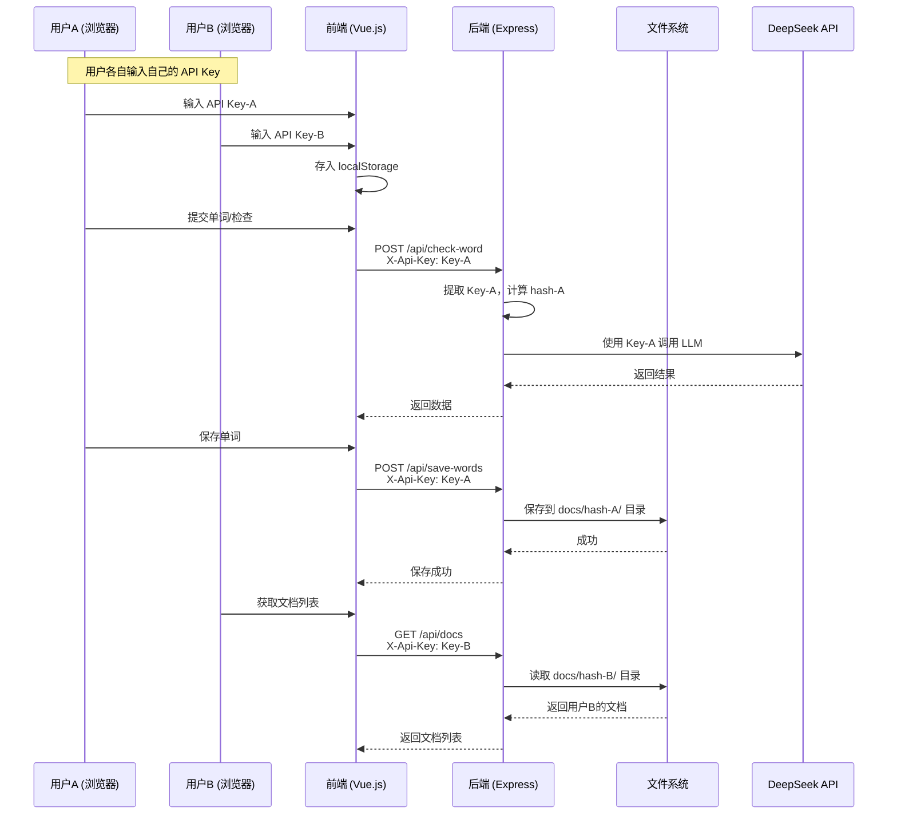

# LLM API Key 用户隔离改造方案

## 1. 背景分析

### 当前架构问题

当前项目使用硬编码在 `server/.env` 中的 `DS_API_KEY`，所有用户共享同一个 API Key，且无法区分不同用户的数据：

```
所有用户 → 前端 → 后端（使用固定 DS_API_KEY）→ DeepSeek API
                                        → docs/（共享目录，所有用户数据混在一起）
```

### 改造目标

1. 允许用户使用自己的 LLM API Key
2. 以 API Key 作为用户身份标识，实现数据隔离
3. 保持向后兼容性

---

## 2. 架构设计

### 核心思路：API Key 即身份

无需注册/登录系统，API Key 本身即为用户认证令牌和身份标识。

```
用户输入 API Key → 存入 localStorage
                  → 每次请求携带 X-Api-Key 请求头
                  → 后端提取 X-Api-Key
                    → 使用该 Key 调用 DeepSeek API
                    → 使用 Key 的 SHA-256 哈希创建用户目录
                    → 数据存储在 docs/{user_hash}/ 下
```

### 用户标识机制

- 前端保存用户的 API Key 原文到 `localStorage`
- 后端对 API Key 做 SHA-256 哈希，取前 16 位作为目录名
- 相同 API Key → 相同哈希 → 相同用户目录 → 数据互通
- 不同 API Key → 不同哈希 → 不同用户目录 → 数据隔离

### 向后兼容

- 保留 `server/.env` 中的 `DS_API_KEY` 作为**服务端默认 Key**
- 当请求未携带 `X-Api-Key` 头时，使用服务端默认 Key，数据存储在 `docs/_default/` 下
- 已有 `docs/` 根目录下的文件可以迁移到 `docs/_default/` 或保持不动

---

## 3. 改造范围

### 3.1 后端改造：`server/index.js`

#### 新增功能模块

| 模块 | 说明 |
|------|------|
| `getUserHash(apiKey)` | 对 API Key 做 SHA-256 哈希，取前 16 位 |
| `getUserDocsDir(apiKey)` | 返回用户文档目录 `docs/{hash}/` |
| `getUserWrongBookPath(apiKey)` | 返回用户错题本路径 |
| `extractApiKey(req)` | 从请求头中提取 API Key，无则返回 `null` |
| `getEffectiveApiKey(apiKey)` | 用户 Key 优先，兜底使用 `process.env.DS_API_KEY` |

#### 需要修改的 API 路由

| 路由 | 改动内容 |
|------|----------|
| `GET /api/health` | 移除 `hasApiKey` 字段（因为 Key 由用户提供）；改为返回服务是否在线 |
| `POST /api/check-word` | 从 `X-Api-Key` 头取 Key；用用户 Key 调用 OpenAI |
| `POST /api/save-words` | 从请求头取 Key；保存到用户目录 |
| `GET /api/docs` | 读取用户目录下的文件 |
| `GET /api/docs/:fileName` | 从用户目录读取文件 |
| `POST /api/docs/:fileName/translate` | 使用用户 Key 调用 LLM |
| `POST /api/docs/:fileName/revert` | 操作用户目录下的文件 |
| `POST /api/docs/batch-translate/:dayKey` | 使用用户 Key，操作用户目录 |
| `POST /api/wrong-book/update` | 使用用户 Key，读写用户目录 |
| `GET /api/wrong-book/status` | 读取用户目录 |

#### 新增 API 路由

| 路由 | 说明 |
|------|------|
| `POST /api/validate-key` | 验证用户提供的 API Key 是否有效（调用一次 DeepSeek 进行测试） |

### 3.2 前端改造

#### 3.2.1 新增 API Key 管理 Store：`src/stores/apiKey.ts`

```typescript
// 职责
- 管理 API Key 的存取（localStorage）
- 提供 API Key 的响应式状态
- 提供设置/清除 API Key 的方法
- 提供验证 API Key 的方法
```

#### 3.2.2 修改 API 层：`src/api/index.ts`

- 所有请求函数增加 `X-Api-Key` 请求头
- 从 `src/stores/apiKey.ts` 获取 API Key
- 导出 `setApiKeyForRequests()` 工具函数

#### 3.2.3 新增 API Key 配置组件

**方案 A：在 `App.vue` 顶部添加 API Key 输入栏**（推荐，改动最小）

- 在服务器状态栏下方或内部添加 API Key 输入框
- 如果未配置 API Key，显示输入提示
- 配置后存入 localStorage，后续请求自动携带

**方案 B：新增独立设置页面**

- 添加 `/settings` 路由
- 提供 API Key 输入和验证功能
- 添加导航入口

采用方案 A 为主，方案 B 可选。

#### 3.2.4 修改 `App.vue`

- 添加 API Key 输入区域
- 修改服务器状态检查逻辑
- 显示当前 API Key 配置状态

#### 3.2.5 修改 `src/api/index.ts` 接口

- 修改 `HealthStatus` 接口：移除 `hasApiKey`，添加服务器是否在线即可
- 所有 API 函数新增 `apiKey` 参数或从 store 自动读取

### 3.3 数据迁移

- 现有 `docs/` 下的文件（`05-24-2123-ai.md`, `05-25-2138-ai.md`, `错题本.md`）属于原硬编码 Key 的用户
- 改造后，这些文件保留在原位置，当请求不带 `X-Api-Key` 时，读取 `docs/` 根目录（作为默认用户）
- 或者：添加数据迁移脚本，将根目录文件迁移到 `docs/_default/` 下

---

## 4. 详细实施步骤

### 步骤 1：后端 - 添加用户隔离工具函数

在 `server/index.js` 中添加：
- `crypto.createHash('sha256')` 哈希函数
- API Key 提取和兜底逻辑
- 用户目录解析函数

### 步骤 2：后端 - 修改所有 API 路由

逐个修改路由，将 `docs/` 替换为用户目录，将 `DS_API_KEY` 替换为用户 Key。

### 步骤 3：后端 - 新增 validate-key 路由

提供一个简单的 API Key 验证端点。

### 步骤 4：前端 - 创建 API Key Store

新建 `src/stores/apiKey.ts`，管理 API Key 的存取。

### 步骤 5：前端 - 修改 API 层

修改 `src/api/index.ts`，为所有请求添加 `X-Api-Key` 头。

### 步骤 6：前端 - 修改 App.vue

添加 API Key 配置 UI，修改状态显示逻辑。

### 步骤 7：前端 - 更新 WordInput.vue 和 DocManager.vue

确保这些组件中的 API 调用能正确传递 API Key。

### 步骤 8：测试

测试多用户数据隔离和向后兼容性。

---

## 5. 数据流图



---

## 6. 目录结构变化

```
docs/                          # 现有目录（作为默认用户目录）
├── 05-24-2123-ai.md
├── 05-25-2138-ai.md
├── 错题本.md
├── _default/                  # 新：默认用户目录（无 API Key 时）
│   ├── ...
├── a1b2c3d4e5f6.../           # 新：用户A的目录（hash-A）
│   ├── 06-22-1005.md
│   ├── 06-22-1005-ai.md
│   └── 错题本.md
└── f6e5d4c3b2a1.../           # 新：用户B的目录（hash-B）
    ├── 06-22-1100.md
    └── 错题本.md
```

---

## 7. 安全性考虑

1. **API Key 不落盘**：后端仅存储 API Key 的哈希值（用于目录命名），原始 Key 仅存于用户浏览器 localStorage
2. **HTTPS 传输**：生产环境下建议通过 HTTPS 传输，防止中间人窃取 API Key
3. **Key 验证**：添加 `/api/validate-key` 端点，让用户可以在使用前验证 Key 有效性
4. **localStorage 安全性**：提醒用户 API Key 存储在浏览器 localStorage 中，不要在不安全的设备上使用
