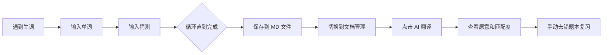
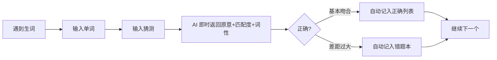

# 🎮 vue-en-h2a 项目改进计划

## 项目目标回顾

用户在玩英文游戏（如 Genshin Impact）时，遇到不认识的英文单词，根据游戏文案的上下文推测词义，然后通过本系统交给 AI 检查，达到**在真实语境中学习英语**的目的。

---

## 当前用户流程痛点



**主要问题**：
1. ❌ **反馈延迟**：猜完后不能立即知道对错，等批量处理时早已忘记当初的上下文
2. ❌ **上下文丢失**：游戏中的原句没有记录，复习时只有孤立的单词
3. ❌ **流程割裂**：输入 → 保存 → 切换页面 → AI 翻译，操作路径太长
4. ❌ **复习单一**：错题本只是静态列表，没有主动测试机制
5. ❌ **缺少统计**：不知道自己的准确率趋势和常见错误类型

---

## 改进方案

### 方案一：🚀 即时 AI 反馈（最高优先级）

在用户输入猜测后**立即**调用 AI 返回原意和匹配结果，形成即时学习闭环。



**改动范围**：
- 新增 API `POST /api/check-word`：接收 `{ word, guess }`，调用 DS API 返回单条结果
- 修改 `WordInput.vue`：猜测提交后自动调用 API，在界面显示原意、词性、匹配度
- 新增后端函数 `callDsForSingleWord(word, guess)`，使用更简洁的 prompt
- 前端增加反馈区域，显示：
  - ✅ 绿色：猜测基本吻合，显示原意 + 词性
  - ❌ 红色：差距过大，显示原意 + 词性 + 你的猜测

### 方案二：📝 添加上下文记录（高优先级）

允许用户在输入单词时，**粘贴游戏中的原句**作为上下文，便于复习时回想。

**改动范围**：
- 单词记录数据结构扩展：`{ word, guess, context?: string }`
- 输入界面增加可选字段"游戏原文"
- MD 文件表格增加"上下文"列
- AI prompt 可结合上下文辅助判断（特别是多义词）
- 错题本复习时显示上下文帮助记忆

### 方案三：🔄 错题复习模式（中优先级）

将错题本从静态列表变为**交互式复习工具**。

**改动范围**：
- 新增复习页面 `/review`
- 展示错题，用户先回忆，点击显示答案
- 支持"掌握了"和"再想想"打分
- 完全掌握的单词移出错题本
- 持续错的单词提高权重

### 方案四：📊 学习仪表盘（中优先级）

提供可视化统计，了解学习进展。

**改动范围**：
- 新增仪表盘页面 `/stats`
- 统计指标：
  - 总学习单词数
  - 总体准确率
  - 按日/周的趋势图
  - 常见错误类型分析（哪些词性容易错？）
- 后端新增统计汇总 API

### 方案五：🔍 文档搜索与过滤（低优先级）

在 Doc Manager 中搜索单词、按匹配度筛选。

**改动范围**：
- 前端增加搜索框，实时过滤文档列表
- 支持按"差距过大"/"基本吻合"筛选
- 支持跨文档搜索单词

---

## 推荐实施路线

| 阶段 | 内容 | 工作量评估 |
|------|------|-----------|
| **Phase 1** | 即时 AI 反馈 | 后端 1 个新 API + 前端修改 |
| **Phase 2** | 添加上下文记录 | 数据结构扩展 + UI 调整 |
| **Phase 3** | 错题复习模式 | 新页面 + 后端 API |
| **Phase 4** | 学习仪表盘 | 统计 API + 图表展示 |
| **Phase 5** | 文档搜索与过滤 | 前端搜索/筛选 |

---

## 各方案的详细技术设计

### Phase 1: 即时 AI 反馈 详细设计

**后端新增 API**：
```
POST /api/check-word
Body: { word: string, guess: string }
Response: { word, pos, meaning, match }
```

新增 `callDsForSingleWord(word, guess)` 函数，prompt 针对单次查询优化，temperature=0.3。

**前端修改**：
- `WordInput.vue` 在 `submitGuess` 后自动调用 `checkWord` API
- 反馈区域设计：
  - 匹配度指示器（绿色/红色圆点）
  - 原意 + 词性展示
  - "继续下一个" 按钮

**store 修改**：
- `word.ts` 新增 `checkResult` 状态
- 新增 `checkWord(word, guess)` action

### Phase 2: 上下文记录 详细设计

**数据结构扩展**：
```typescript
interface WordItem {
  word: string
  guess: string
  context?: string  // 新增
}
```

**输入界面**：
- 在输入单词后，可选填入"出现的句子/上下文"
- 使用 `<textarea>` 支持多行

**MD 文件格式扩展**：
`| 序号 | 英文单词 | 上下文 | 我的猜测 | 原意 | 匹配度 | 词性 |`

**

API 调整**：
- `POST /api/save-words` 接收扩展后的 `WordItem`
- AI prompt 可传入上下文辅助判断

### Phase 3: 错题复习 详细设计

**新页面 `/review`**：
- 从错题本 API 获取错题列表
- 卡片式展示：先显示单词 → 用户思考 → 点击翻转显示答案（原意+词性+猜测+来源）
- 用户标记"已掌握"或"仍需复习"
- 后端新增 `PATCH /api/wrong-book/:key` 移除已掌握的题

---

## Q&A

**Q: 为什么不直接用批量处理，而要做即时反馈？**
A: 学习语言的关键在于**即时纠错**。如果猜测错误，等待半小时才看到结果，大脑已经失去了对上下文的连接。即时反馈利用的是"测试效应"——立即知道自己错了，记忆更深刻。

**Q: 上下文记录会不会让输入变麻烦？**
A: 设计为**可选字段**。短的句子可以快速输入，长句可以用 Ctrl+V 粘贴。输入框有占位提示，用户自行决定是否填写。

**Q: 复习模式和普通看文档有什么区别？**
A: 普通文档是**被动阅读**，复习模式是**主动回忆**。主动回忆的 retention rate 远高于被动阅读（约 80% vs 20%）。
