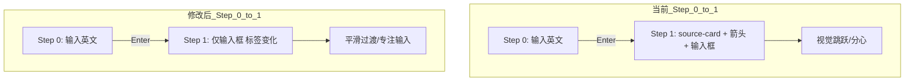
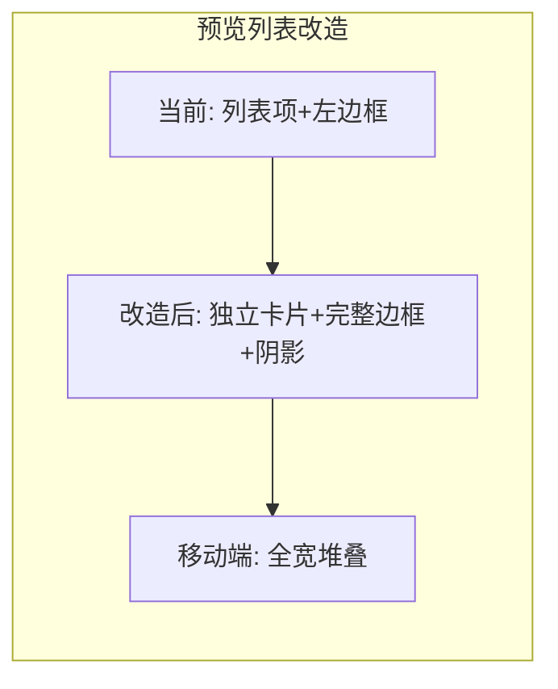

# 计划：优化 Step 1 布局 & 预览列表卡片化

## 问题概述

### 问题 1：Step 1 的 source-card 导致视觉跳跃

当前流程中，用户在 **Step 0** 输入英文单词后按 Enter，进入 **Step 1** 猜测中文含义。此时页面从：

```
[输入框：英文单词]           ← Step 0：只有输入框
```

突然变为：

```
┌─────────────────────┐
│      英语           │
│    beautiful        │  ← source-card（大卡片）
└─────────────────────┘
         ↓ 箭头
[输入框：中文含义猜测]      ← Step 1：卡片 + 箭头 + 输入框
```

这种剧烈的视觉变化会分散用户注意力——用户刚输入完单词，不需要再看到一个大卡片展示同样的内容。

### 问题 2：已记录单词列表不是卡片布局

预览区域（`.preview-section`）使用 flex 行 + 左边框颜色标记，在小屏手机上显示不够清晰：

```
| #1  word → guess  [OK]      ← 类似列表项
```

用户希望用 **卡片形式** 展示，保证在手机上窄屏幕也能清晰显示。

---

## 修改方案

### 修改 1：Step 1 简化——移除 source-card 和箭头

**文件**: [`src/views/WordInput.vue`](../src/views/WordInput.vue)

#### 模板变更（第 174-200 行）

移除 Step 1 中的 `.source-card` 和 `.arrow-down` 两个 DOM 元素。Step 1 的布局变得和 Step 0 几乎一致——仅有一个居中输入框，标签从"英文单词"变为"中文含义猜测"。

**当前代码（移除部分）**:

```html
<!-- ===== 步骤 1: 输入含义猜测 ===== -->
<div v-else class="input-stage" :class="{ 'animate-in': animateIn }">
  <!-- 删除 ↓ -->
  <div class="source-card" ref="sourceCardRef">
    <div class="source-card-label">英语</div>
    <div class="source-card-word">{{ store.currentWord }}</div>
  </div>
  <!-- 删除 ↑ -->

  <!-- 删除 ↓ -->
  <div class="arrow-down">
    <svg width="20" height="20" viewBox="0 0 20 20" fill="none">
      <path d="M10 4v12M6 12l4 4 4-4" stroke="var(--color-accent-blue, #007aff)" stroke-width="2" stroke-linecap="round" stroke-linejoin="round"/>
    </svg>
  </div>
  <!-- 删除 ↑ -->

  <div class="input-card">
    <label class="input-card-label">中文含义猜测</label>
    <input ...>
    <p class="input-hint">按 Enter 提交猜测</p>
  </div>
</div>
```

**修改后**:

```html
<!-- ===== 步骤 1: 输入含义猜测 ===== -->
<div v-else class="input-stage" :class="{ 'animate-in': animateIn }">
  <div class="input-card">
    <label class="input-card-label">中文含义猜测</label>
    <input ...>
    <p class="input-hint">按 Enter 提交猜测</p>
  </div>
</div>
```

#### CSS 变更：清理不再需要的样式

删除以下样式规则（第 637-678 行）：

| 选择器 | 行号 | 说明 |
|--------|------|------|
| `.source-card` | 638-646 | 不再需要 |
| `.source-card-label` | 648-655 | 不再需要 |
| `.source-card-word` | 657-663 | 不再需要 |
| `.arrow-down` | 666-672 | 不再需要 |
| `@keyframes arrow-bounce` | 674-678 | 不再需要 |

同时删除移动端适配中对应的样式（第 1320-1326 行）：

| 选择器 | 行号 |
|--------|------|
| `.source-card` (移动端) | 1320-1322 |
| `.source-card-word` (移动端) | 1324-1326 |

#### 删除不再需要的 `ref`

删除模板中 `ref="sourceCardRef"` 以及在 `<script setup>` 中对应的 `sourceCardRef` 定义（目前 script 中没有看到 `sourceCardRef` 定义，只有模板中有引用；需要确认并清理）。

### 修改 2：预览列表改为卡片形式

**文件**: [`src/views/WordInput.vue`](../src/views/WordInput.vue)

#### 模板变更：不需要改动

预览列表的 HTML 结构（第 207-233 行）基本保持不变。卡片效果通过 CSS 实现。

#### CSS 变更

将 `.preview-list` 改为卡片网格布局：

| 属性 | 旧值 | 新值 |
|------|------|------|
| `gap` | `4px` | `8px`（增加间距，让每个卡片独立） |
| `display` | `flex` | `grid`（或保持 flex 但增强） |

将 `.preview-item` 改为完整卡片：

| 属性 | 状态 | 说明 |
|------|------|------|
| `border-left: 3px solid ...` | 改为 | `border: 1.5px solid ...`（用完整边框替代左边框） |
| `border-radius` | 已存在 | 保持 `var(--radius-md)` |
| `padding` | 已有 | 适当增加 |
| `box-shadow` | 新增 | `var(--shadow-sm)` 增加卡片立体感 |
| `flex-wrap` | 已有 | 保持 `wrap` |

**.preview-item.preview-match**：
- 边框色 → `var(--color-accent-green, #34c759)`
- 背景 → 浅绿底色（`#f0faf0`）

**.preview-item.preview-mismatch**：
- 边框色 → `var(--color-accent-red, #ff3b30)`
- 背景 → 浅红底色（`#fcf0f0`）

#### 移动端适配优化

在 `@media (max-width: 480px)` 中，确保卡片在小屏上：

- 每个卡片占满宽度
- 内部元素合理换行
- 触控目标足够大

---

## 预期效果

### 修改后流程

**Step 0 → Step 1 过渡**（更加平滑）：

```
[输入框：英文单词]           ← Step 0
         ↓ Enter
[输入框：中文含义猜测]        ← Step 1（仅标签变化，无新元素出现）
```

用户只需关注输入内容的变化，不会被新出现的卡片干扰。

### 已记录单词卡片

```
┌──────────────────────────────────┐
│ #1  beautiful → 美丽的  [✓ OK]  │  ← 完整卡片，绿色边框
└──────────────────────────────────┘
┌──────────────────────────────────┐
│ #2  apple → 苹果       [✓ OK]  │  ← 完整卡片，绿色边框
└──────────────────────────────────┘
┌──────────────────────────────────┐
│ #3  dog → 猫           [✗ ×]   │  ← 完整卡片，红色边框
│     真实含义：狗                 │
└──────────────────────────────────┘
```

在手机上，卡片自动占满宽度，每个单词独立清晰。

---

## 修改清单

| # | 文件 | 修改内容 | 类型 |
|---|------|---------|------|
| 1 | `src/views/WordInput.vue` | Step 1 模板：移除 `.source-card` 和 `.arrow-down` | 模板 |
| 2 | `src/views/WordInput.vue` | 删除 `.source-card` / `.arrow-down` / `@keyframes arrow-bounce` CSS | CSS |
| 3 | `src/views/WordInput.vue` | 删除移动端 `.source-card` / `.source-card-word` CSS | CSS |
| 4 | `src/views/WordInput.vue` | 预览列表卡片化 CSS：增加间距、边框、背景色、阴影 | CSS |
| 5 | `src/views/WordInput.vue` | 移动端适配：优化卡片布局 | CSS |

---

## 流程图




