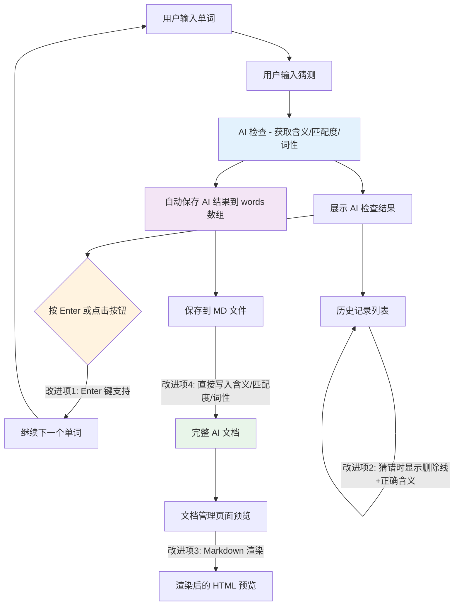

# 用户体验改进计划

## 概述

基于对项目代码的全面分析，针对用户提出的 4 个优化点，制定以下改进方案。当前项目是一个英语单词学习工具，核心流程：输入单词 → 猜测含义 → AI 检查 → 保存到 Markdown 文件。

---

## 改进项 1：按 Enter 进入下一个流程

### 现状分析

当前在步骤 2（AI 检查结果展示页），用户必须点击按钮才能进入下一个单词：
[`WordInput.vue:203`](src/views/WordInput.vue:119)

```vue
<button class="btn btn-primary btn-large" @click="store.proceedToNext()">
  {{ store.isComplete ? '🎉 查看总结' : '➡️ 继续下一个' }}
</button>
```

### 改动方案

在 [`WordInput.vue`](src/views/WordInput.vue) 的 `<script setup>` 中添加一个全局键盘事件监听。

- 当 `store.step === 2`（正在显示结果）、`!store.checking`（加载完成）、`!store.checkError`（无错误）时，监听 `keydown.Enter` 事件
- 按 Enter 时调用 `store.proceedToNext()`
- 使用 `onMounted` / `onUnmounted` 生命周期钩子管理事件监听器的注册与销毁

### 涉及文件

| 文件 | 改动类型 |
|------|----------|
| [`src/views/WordInput.vue`](src/views/WordInput.vue) | 新增键盘事件监听逻辑 |

---

## 改进项 2：猜错时历史记录样式优化

### 现状分析

在单词预览列表和完成区域中，当 `item.match === '差距过大'` 时，目前只是用红色左边框标识：
[`WordInput.vue:123-134`](src/views/WordInput.vue:123)

```vue
<div v-for="(item, index) in store.words" :key="index" class="word-item"
    :class="{ 'item-match': item.match === '基本吻合', 'item-mismatch': item.match === '差距过大' }">
    <span class="word-index">#{{ index + 1 }}</span>
    <span class="word-en">{{ item.word }}</span>
    <span class="word-sep">→</span>
    <span class="word-guess">{{ item.guess }}</span>
    <!-- 没有显示正确含义的删除线效果 -->
```

### 改动方案

对于 `match === '差距过大'` 的单词项：
1. 用户的猜测（`item.guess`）添加删除线（`text-decoration: line-through`）并标为灰色
2. 猜测后面追加真实含义（`item.meaning`），用绿色或蓝色正常显示

具体改动：
- 在模板中，`word-guess` 区域根据 `item.match` 条件添加 CSS 类 `guess-strikethrough`
- 在 `word-guess` 后面追加显示正确含义：`<span class="word-correct-meaning">{{ item.meaning }}</span>`
- 添加对应的 CSS 样式

预览列表（`store.step === 0 || 1`）和完成区域（`store.step === 3`）中各有一个 `v-for` 循环，两处都需要同步修改。

### 涉及文件

| 文件 | 改动类型 |
|------|----------|
| [`src/views/WordInput.vue`](src/views/WordInput.vue) | 模板中两处单词列表渲染 + 新增 CSS 样式 |

---

## 改进项 3：Markdown 渲染预览

### 现状分析

当前文档管理器中的预览只是用 `<pre>` 标签显示原始 Markdown 文本：
[`DocManager.vue:237-239`](src/views/DocManager.vue:237)

```vue
<pre v-else class="preview-content">{{ previewContent }}</pre>
```

### 改动方案

需要引入一个轻量级的 Markdown 渲染方案。有两种选择：

**方案 A：使用 `marked` 库（推荐）**
- 安装 `marked` 依赖（纯 JS，零依赖，体积小）
- 在模板中将 `<pre>` 替换为 `<div v-html="renderedContent">`
- 在 script 中通过 `computed` 或转换函数将原始 Markdown 转为 HTML

**方案 B：使用 `vue-markdown` 组件**
- 但本项目使用的是 Vue 3，需要确认兼容性

推荐方案 A，原因：
- 零依赖（`marked` 本身无额外依赖）
- 体积极小（约 20KB）
- 与 Vue 3 完美兼容，直接通过 `v-html` 绑定

### 涉及文件

| 文件 | 改动类型 |
|------|----------|
| [`package.json`](package.json) | 新增 `marked` 依赖 |
| [`src/views/DocManager.vue`](src/views/DocManager.vue) | 引入 marked，替换预览渲染方式 |

---

## 改进项 4：录入时 AI 检查结果直接保存到文档

### 现状分析

当前的完整流程：
1. 用户在 `WordInput` 中输入单词 → 猜测 → AI 检查
2. 所有单词录入完成后，保存到文件
3. 用户需要到 `DocManager` 中对保存的文件再次执行"AI 翻译"，才能得到带含义和匹配度的文档

问题：步骤 1 中 AI 已经检查过每个单词，结果已存储在 `words` 数组中（`meaning`、`match`、`pos` 字段），但保存时未写入文件。

代码证据 — Store 中已有完整数据：
[`word.ts:136-141`](src/stores/word.ts:136)

```typescript
const result = await checkWord(word, guess)
checkResult.value = result
const lastWord = words.value[words.value.length - 1]
if (lastWord) {
  lastWord.meaning = result.meaning
  lastWord.match = result.match
  lastWord.pos = result.pos
}
```

但服务器保存时只用了 word 和 guess：
[`server/index.js:297-305`](server/index.js:297)

```javascript
let mdContent = `# 单词记录\n\n`
mdContent += `**记录时间**: ${now.format('YYYY-MM-DD HH:mm:ss')}\n\n`
mdContent += `**单词数量**: ${count}\n\n`
mdContent += `| 序号 | 英文单词 | 我的猜测 |\n`
mdContent += `| --- | --- | --- |\n`
words.forEach((item, index) => {
  mdContent += `| ${index + 1} | ${item.word} | ${item.guess} |\n`
})
```

### 改动方案

修改服务器 [`server/index.js`](server/index.js) 中的 `/api/save-words` 接口，在写入 MD 文件时，如果单词条目中包含 `meaning`、`match`、`pos` 字段，则自动生成包含"原意"、"匹配度"、"词性"列的完整表格。

改动要点：
1. **检查是否有 AI 数据**：如果 `words` 数组中任一元素包含 `meaning` 字段，则认为有 AI 结果
2. **动态生成表头**：有 AI 数据时表头为 `| 序号 | 英文单词 | 我的猜测 | 原意 | 匹配度 | 词性 |`，否则为原始表头
3. **文件名标记**：有 AI 数据时，文件名自动添加 `-ai` 后缀（如 `06-22-1248-ai.md`）

这样保存后生成的 MD 文件直接就是完整的带 AI 结果的文档，用户无需再到文档页面执行 AI 检查。

### 涉及文件

| 文件 | 改动类型 |
|------|----------|
| [`server/index.js`](server/index.js) | 修改 `/api/save-words` 接口，支持写入 AI 结果 |

---

## 影响总结



---

## 执行顺序

| 顺序 | 改进项 | 主要文件 | 复杂度 |
|------|--------|----------|--------|
| 1 | 改进项 4：保存时写入 AI 结果 | `server/index.js` | 中 |
| 2 | 改进项 1：按 Enter 进入下一步 | `WordInput.vue` | 低 |
| 3 | 改进项 2：猜错时显示删除线+正确含义 | `WordInput.vue` | 低 |
| 4 | 改进项 3：Markdown 渲染预览 | `package.json`, `DocManager.vue` | 低 |

> **注意**：改进项 4 是基础性改动（后端），推荐优先完成。改进项 1 和 2 可并行执行。改进项 3 不依赖其他项。

## 不涉及改动的文件

- [`src/App.vue`](src/App.vue) — 全局布局，无需改动
- [`src/stores/word.ts`](src/stores/word.ts) — 数据逻辑完备，无需改动
- [`src/api/index.ts`](src/api/index.ts) — API 接口定义完备，无需改动
- [`src/router/index.ts`](src/router/index.ts) — 路由配置，无需改动
